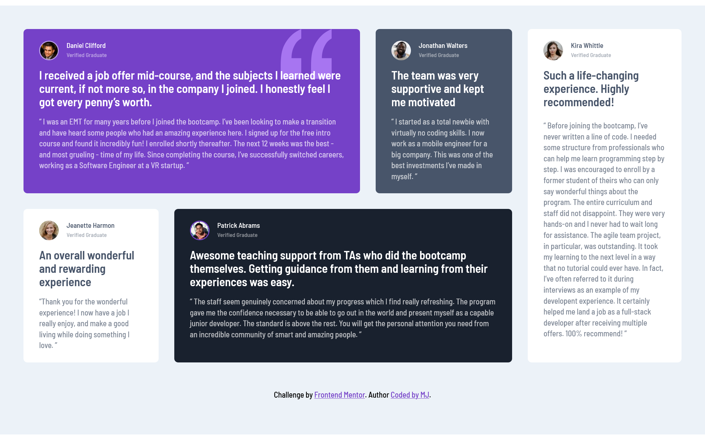

# Frontend Mentor -  Testimonials grid section solution

This is my solution to the [Testimonials grid section challenge on Frontend Mentor](https://www.frontendmentor.io/challenges/testimonials-grid-section-Nnw6J7Un7). Frontend Mentor challenges help you improve your coding skills by building realistic projects. 

### Overview

### Links

- Solution URL: [Click to view Solution](https://www.frontendmentor.io/solutions/responsive-testimonial-grid-section-HYz8Tm6Of8)
- Live Site URL: [Click to view Live Site](https://coded-by-mj.github.io/Front-end-Mentor-Challenge6/)

## My process

### Built with
- Semantic HTML5 markup
- CSS custom properties
- CSS Grid
- Mobile First Workflow

## Author

- Frontend Mentor - [@Coded-by-MJ](https://www.frontendmentor.io/profile/Coded-by-MJ)
- Twitter - [@Coded-by-MJ](https://twitter.com/Coded_by_MJ)
